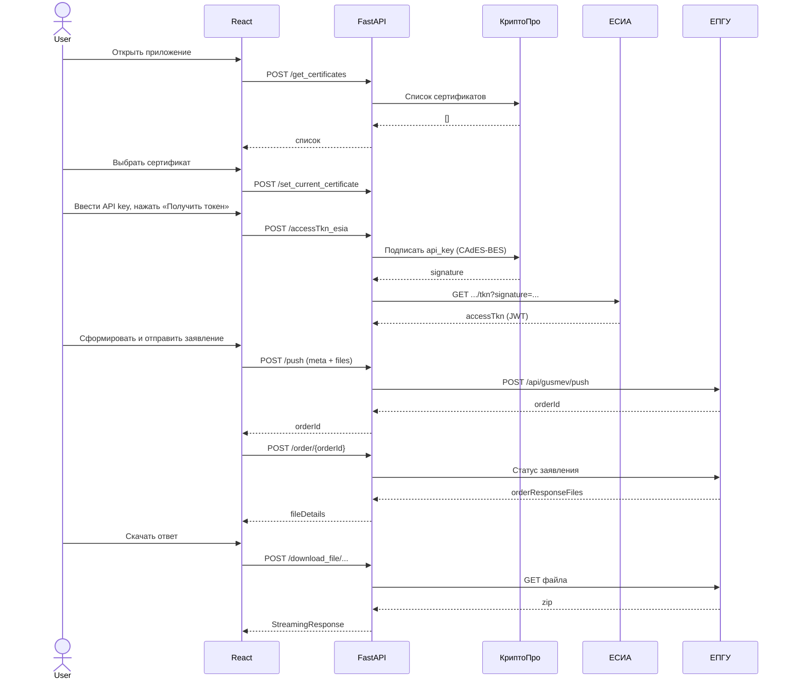

# HOWTO — развёртывание и использование

Практическое руководство: от клонирования репозитория до успешной подачи заявления через ЕПГУ.

## 1. Предварительные требования

- Docker ≥ 24 и Docker Compose v2
- Сертификат организации (формат контейнера `xxx.000` для КриптоПро)
- API-ключ организации-потребителя ЕПГУ (получение — см. [docs/](./docs) регламенты)
- Доступ к тестовому контуру ЕПГУ: `*.test.gosuslugi.ru`

## 2. Настройка окружения

Создайте файл `.env` в корне репозитория:

```env
apikey=<GUID-API-ключа>
KeyPin=<PIN-код контейнера>
TSAAddress=http://testca2012.cryptopro.ru/tsp/tsp.srf
esia_host=https://esia-portal1.test.gosuslugi.ru
svcdev_host=https://svcdev-beta.test.gosuslugi.ru
production=
BACKEND_URL=/api
key_folder=./api-gosuslugi-backend/xxx.000
SERVICES={"10000000367":{"description":"Заявление/ходатайство/объяснение","req_file":"req.xml","piev_epgu_file":"piev_epgu.xml"}}
```

Положите содержимое контейнера ключа в папку, указанную в `key_folder`.

## 3. Сборка и запуск

```bash
docker-compose up -d --build
docker-compose logs -f api
```

Проверки:

```bash
curl http://localhost:5000/hc        # {"status":"Ok"}
curl http://localhost:5000/status    # версия PyCades
```

Открыть UI: <http://localhost:5080>.

## 4. Типовой сценарий подачи заявления



Подробнее о каждом эндпоинте — [docs/api.md](./docs/api.md).

## 5. Отладка

- `production` не задан → backend запускает `debugpy` на `:5678`. Подключитесь из VS Code (launch config «Python: Remote Attach»).
- Логи: `docker-compose logs -f api frontend`.
- Проверка XML по XSD: эндпоинт `/push/chunked` валидирует `piev_epgu.xml`. Локально — `GET /xsd?simple_type_name=<name>` вернёт перечисления из XSD.

## 6. Частые проблемы

| Симптом | Причина | Решение |
|---|---|---|
| «Сертификаты не найдены» на старте | Контейнер не смонтирован / не прочитан | Проверить `key_folder`, права на файлы внутри контейнера |
| 401 от ЕСИА | Неверный `apikey` или `KeyPin` | Сверить `.env`, проверить срок действия API-ключа |
| `Invalid XML` на `/push/chunked` | `piev_epgu.xml` не соответствует XSD | Сверить структуру с [docs/schemas.md](./docs/schemas.md) |
| CORS в браузере | Обращение не через Nginx-прокси | Ходить через `http://localhost:5080`, `/api` проксируется |

## 7. Обновление

```bash
git pull
docker-compose up -d --build
```

## 8. Очистка

Windows:
```cmd
clear.bat
```

Или вручную: `docker-compose down -v` и удаление собранных образов.
