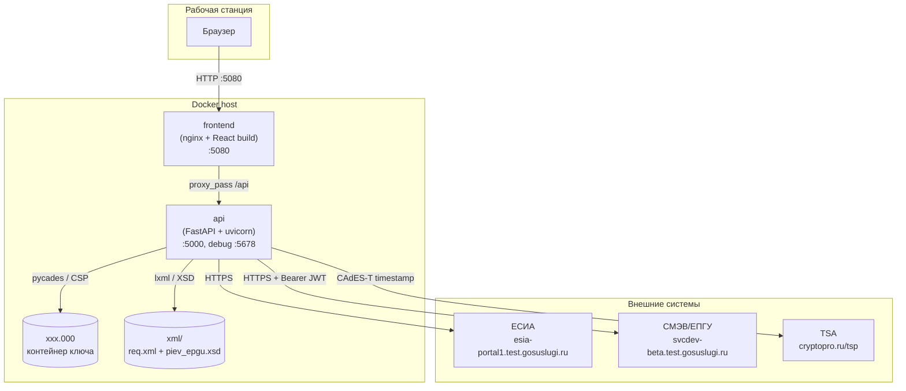
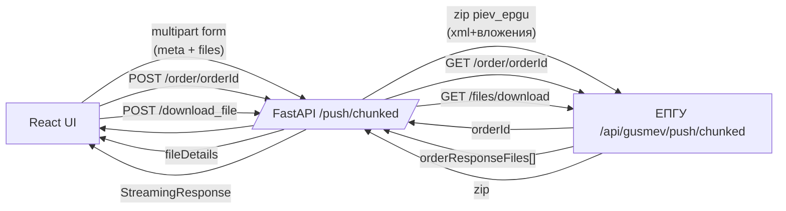
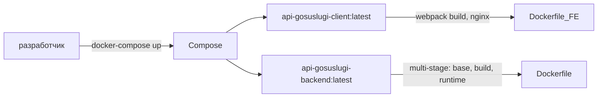

# Архитектура

## Обзор

Система состоит из двух контейнеризованных компонентов и внешних зависимостей (ЕСИА/ЕПГУ и КриптоПро CSP).

## C4 — уровень «Контейнеры»

## Компоненты

### Frontend (`api-gosuslugi-client`)

- React + Ant Design + AceEditor для XML-редактора.
- Все сетевые вызовы идут на относительный путь `/api` → проксируются Nginx.
- Пользовательские файлы (XML, приложения) кешируются в IndexedDB (`files-db`).
- JWT от ЕСИА декодируется (`jwt-decode`) для индикации срока действия.

### Backend (`api-gosuslugi-backend`)

- FastAPI, один модуль `app.py`, состояние — глобальные переменные процесса.
- `pycades` (PyCades от КриптоПро) — загрузка сертификатов, подпись CAdES-BES.
- `httpx.AsyncClient` — асинхронные вызовы внешних API.
- `lxml` — валидация XML по XSD-схеме `piev_epgu.xsd`.
- Startup-hook загружает сертификаты из персонального хранилища CSP.

## Потоки данных

## Состояние бэкенда

Backend — **stateless per-request** снаружи, но держит глобальное in-process состояние:

| Переменная | Значение |
|---|---|
| `CERTIFICATES` | dict thumbprint → cert object (из хранилища CSP) |
| `CURRENT_CERT_ID` | thumbprint выбранного сертификата |
| `ACCESS_TKN_ESIA` | последний полученный JWT от ЕСИА |
| `services_dict` | справочник услуг (из env `SERVICES`) |
| `schema` | скомпилированный `XMLSchema` из `piev_epgu.xsd` |

БД нет. Это ограничение — при перезапуске контейнера токен и активный сертификат сбрасываются.

## Развёртывание

Подробнее: [deployment.md](./deployment.md).

## Технологический стек

| Слой | Технология |
|---|---|
| UI | React 18, Ant Design, AceEditor, axios, moment, dayjs |
| Хранение UI | IndexedDB, sessionStorage, localStorage |
| Gateway | Nginx (alpine) |
| Backend | Python 3.12, FastAPI, uvicorn |
| Крипто | КриптоПро CSP 5.0, pycades, CAdES-BES |
| XML | lxml + XSD (`piev_epgu.xsd`) |
| HTTP | httpx (async) |
| Контейнеризация | Docker multi-stage, docker-compose v3.9 |

## Ограничения и техдолг

- Нет БД — состояние сессий теряется.
- Глобальный `ACCESS_TKN_ESIA` — один токен на процесс, не мультитенантно.
- CORS `allow_origins=['*']` — допустимо для dev-контура, неприемлемо для прод.
- `KeyPin` передаётся как переменная окружения.
- Нет rate-limit и аудит-журнала операций подписания.
