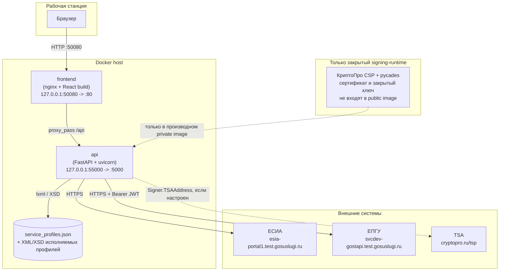
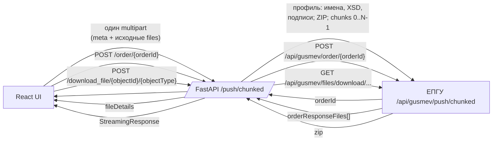
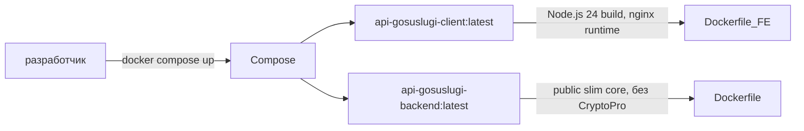

# Архитектура

> Актуализировано: **2026-08-12**. Общий транспорт соответствует API ЕПГУ v1.14, а XML/XSD, подпись и способ отправки берутся из профилей свежего [каталога API для госорганов](https://partners.gosuslugi.ru/catalog/api_for_gu).

## Обзор

Система состоит из frontend, backend, переиспользуемой Python-библиотеки `epgu-api` и внешних ЕСИА/ЕПГУ. Публичный backend-образ работает в catalogue/core-режиме без проприетарных компонентов; для подписи собирается отдельный закрытый runtime с законно полученными КриптоПро CSP и `pycades`.

## C4 - уровень «Контейнеры»

```mermaid
flowchart TB
    subgraph Client["Рабочая станция"]
        BROW[Браузер]
    end

    subgraph Host["Docker host"]
        FE["frontend
(nginx + React build)
127.0.0.1:50080 -> :80"]
        BE["api
(FastAPI + uvicorn)
127.0.0.1:55000 -> :5000"]
        VOL2[(service_profiles.json
+ XML/XSD исполняемых профилей)]
    end

    subgraph Licensed["Только закрытый signing-runtime"]
        CRYPTO["КриптоПро CSP + pycades
сертификат и закрытый ключ
не входят в public image"]
    end

    subgraph External["Внешние системы"]
        ESIA["ЕСИА
esia-portal1.test.gosuslugi.ru"]
        EPGU["ЕПГУ
svcdev-gostapi.test.gosuslugi.ru"]
        TSA["TSA
cryptopro.ru/tsp"]
    end

    BROW -->|HTTP :50080| FE
    FE -->|proxy_pass /api| BE
    CRYPTO -.->|только в производном private image| BE
    BE -->|lxml / XSD| VOL2
    BE -->|HTTPS| ESIA
    BE -->|HTTPS + Bearer JWT| EPGU
    BE -.->|Signer.TSAAddress, если настроен| TSA
```

## Компоненты

### Frontend (`api-gosuslugi-client`)

- React + Ant Design + AceEditor для XML-редактора.
- Build-stage использует Node.js 24 и `npm ci`; финальный nginx-образ не содержит Node или devDependencies.
- Все сетевые вызовы идут на относительный путь `/api` -> проксируются Nginx.
- Пользовательские файлы (XML, приложения) кешируются в IndexedDB (`files-db`).
- JWT от ЕСИА декодируется (`jwt-decode`) для индикации срока действия.

### Backend (`api-gosuslugi-backend`)

- FastAPI, один модуль `app.py`, состояние - глобальные переменные процесса.
- `epgu-api` - модели транспорта, ZIP и typed-контракты Госключа.
- `pycades` (опционально, вне публичного образа) - загрузка сертификатов и detached CAdES-BES.
- `httpx.AsyncClient` - асинхронные вызовы внешних API.
- `lxml` - безопасный разбор и валидация документа по XSD именно его профиля.
- Lifespan-hook пытается загрузить сертификаты, но отсутствие CSP не мешает каталогу, Swagger и preview работать; signing endpoints отвечают `503`.
- Версионируемый реестр содержит 21 профиль: 3 `verified`/исполняемых профиля Госключа и 18 `reference`/заблокированных. Frontend показывает обе группы, но backend применяет fail-closed проверку перед preview рабочего шаблона и отправкой. У `60010153` каталогизированы схема и транспорт, однако XML демонстрационный; включение требует типизированной формы, fail-closed проверки placeholder/полей и приёмки в авторизованном контуре.

## Потоки данных

```mermaid
flowchart LR
    A[React UI] -- один multipart
(meta + исходные files) --> B[/FastAPI /push/chunked/]
    B -- профиль: имена, XSD,
подписи; ZIP; chunks 0..N-1 --> C[ЕПГУ /api/gusmev/push/chunked]
    C -- orderId --> B --> A
    A -- POST /order/{orderId} --> B
    B -- POST /api/gusmev/order/{orderId} --> C
    C -- orderResponseFiles[] --> B
    B -- fileDetails --> A
    A -- POST /download_file/{objectId}/{objectType} --> B
    B -- GET /api/gusmev/files/download/... --> C
    C -- zip --> B -- StreamingResponse --> A
```

## Состояние бэкенда

Backend - **stateless per-request** снаружи, но держит глобальное in-process состояние:

| Переменная | Значение |
|---|---|
| `CERTIFICATES` | dict thumbprint -> cert object (из хранилища CSP) |
| `CURRENT_CERT_ID` | thumbprint выбранного сертификата |
| `ACCESS_TKN_ESIA` | последний полученный JWT от ЕСИА |
| `ACCESS_TKN_EXP` | извлечённый срок действия JWT |
| `services_dict` | 21 валидированный профиль из `service_profiles.json` + строгий overlay `SERVICES` |
| `_load_schema` cache | до 32 скомпилированных XSD исполняемых профилей |

БД нет. При перезапуске контейнера токен и активный сертификат сбрасываются. Поскольку эти значения глобальны для процесса, поддерживаемая топология — один доверенный оператор на одном loopback-only стенде, а не многопользовательский gateway.

## Развёртывание

```mermaid
flowchart LR
    Dev[разработчик] -->|docker compose up| Compose
    Compose --> FE_IMG[api-gosuslugi-client:latest]
    Compose --> BE_IMG[api-gosuslugi-backend:latest]
    BE_IMG -->|public slim core, без CryptoPro| Dockerfile
    FE_IMG -->|Node.js 24 build, nginx runtime| Dockerfile_FE
```

Подробнее: [deployment.md](./deployment.md).

## Технологический стек

| Слой | Технология |
|---|---|
| UI | React 18, Ant Design, AceEditor, Axios 1.19.0, moment, dayjs; Node.js 24 build-stage |
| Хранение UI | IndexedDB, sessionStorage, localStorage |
| Gateway | Nginx (alpine) |
| Backend | Python 3.12, FastAPI, uvicorn |
| Крипто | опциональный лицензированный КриптоПро CSP/pycades, detached CAdES-BES |
| XML | lxml + per-service XSD; typed-генераторы `epgu-api` |
| HTTP | httpx (async) |
| Контейнеризация | публичный Python slim Docker image + Docker Compose |

## Ограничения и техдолг

- Нет БД - состояние сессий теряется.
- `ACCESS_TKN_ESIA` и `CURRENT_CERT_ID` глобальны для процесса: один оператор, без мультитенантности и изоляции пользователей.
- Compose привязывает frontend и backend к `127.0.0.1`; сетевое или многопользовательское развёртывание без дополнительной аутентификации, TLS, per-session state, rate-limit и аудита не поддерживается.
- CORS управляется env `ALLOWED_ORIGINS` (см. [.env.example](../.env.example)); compose по умолчанию разрешает только `http://localhost:50080`, в prod нужен точный домен.
- `KeyPin` передаётся как переменная окружения (рекомендуется Docker secrets / Vault в проде).
- Нет rate-limit и аудит-журнала операций подписания.
- `exp` JWT парсится без верификации и возвращается клиенту/в `/version`; авто-обновление по приближению `exp` пока не реализовано - инициирует клиент.
