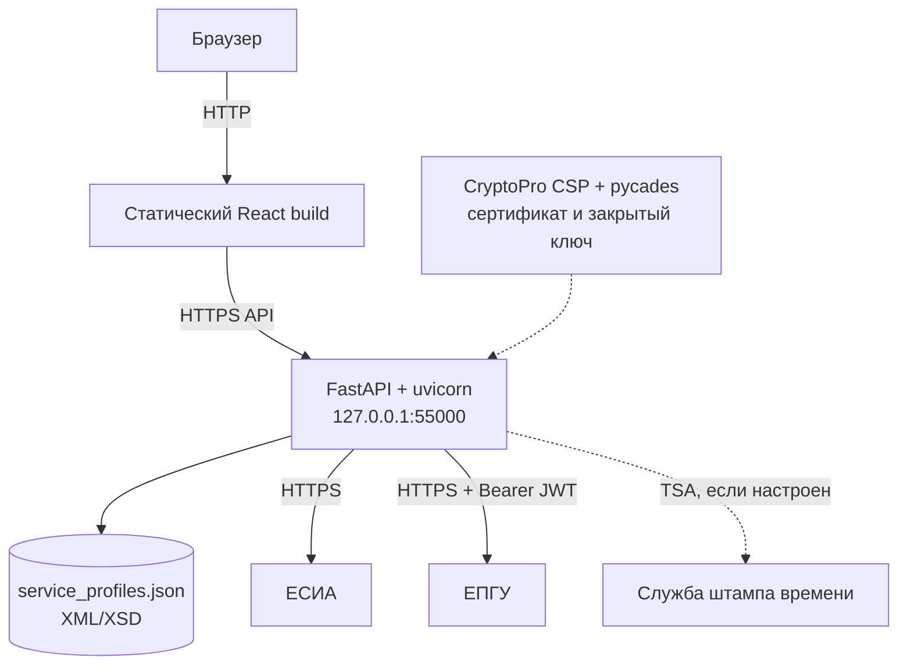
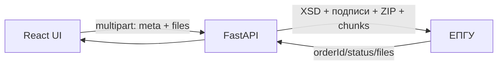
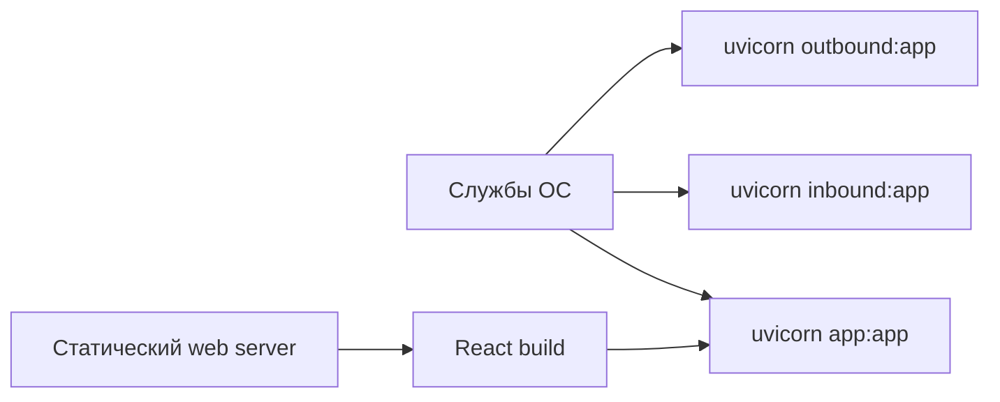

# Архитектура

> Актуализировано: **2026-09-03**. Общий транспорт соответствует API ЕПГУ
> v1.14, а XML/XSD, подпись и способ отправки берутся из профиля услуги.

## Обзор

Система состоит из React frontend, FastAPI backend, переиспользуемой библиотеки
`epgu-api` и внешних ЕСИА/ЕПГУ. Публичное ядро работает без проприетарных
компонентов; подпись включается только на хосте с законно полученными CryptoPro
CSP и совместимым `pycades`.

```mermaid
flowchart TB
    BROW[Браузер] -->|HTTP| FE[Статический React build]
    FE -->|HTTPS API| BE[FastAPI + uvicorn\n127.0.0.1:55000]
    BE --> PROFILES[(service_profiles.json\nXML/XSD)]
    CRYPTO[CryptoPro CSP + pycades\nсертификат и закрытый ключ] -.-> BE
    BE -->|HTTPS| ESIA[ЕСИА]
    BE -->|HTTPS + Bearer JWT| EPGU[ЕПГУ]
    BE -.->|TSA, если настроен| TSA[Служба штампа времени]
```

## Компоненты

### Frontend

- React + Ant Design + Ace Editor.
- При запуске разработки Node.js 24 обслуживает dev bundle; для production
  каталог `build/` отдаёт статический веб-сервер администратора.
- Адрес backend встраивается через `REACT_APP_BACKEND_URL`.
- Пользовательские файлы кешируются в IndexedDB, сессия - в browser storage.

### Backend

- Python 3.12, FastAPI и uvicorn.
- `epgu-api` реализует модели транспорта, ZIP и typed-контракты Госключа.
- `httpx` обращается к внешним API; `lxml` безопасно проверяет XML по XSD.
- `pycades` опционален. Без него каталог, Swagger и preview доступны, а signing
  endpoint-ы fail closed с `503`.
- Реестр содержит 21 профиль: 3 исполняемых и 18 справочных. Backend повторно
  проверяет `status=verified`/`available=true` перед отправкой.

## Поток заявления

```mermaid
flowchart LR
    UI[React UI] -->|multipart: meta + files| API[FastAPI]
    API -->|XSD + подписи + ZIP + chunks| EPGU[ЕПГУ]
    EPGU -->|orderId/status/files| API
    API --> UI
```

## Состояние backend

| Значение | Где живёт |
|---|---|
| `CERTIFICATES`, `CURRENT_CERT_ID` | память одного процесса |
| `ACCESS_TKN_ESIA`, `ACCESS_TKN_EXP` | память одного процесса |
| `services_dict` | `service_profiles.json` + строгий `SERVICES` overlay |
| скомпилированные XSD | process cache |

БД для сессии нет. При перезапуске процесса токен и активный сертификат
сбрасываются. Поддерживаемая публичным ядром топология - один доверенный
оператор на loopback-only backend, а не общий многопользовательский gateway.

## Процессы на хосте

```mermaid
flowchart LR
    OS[Службы ОС] --> BE[uvicorn app:app]
    OS --> IN[uvicorn inbound:app]
    OS --> OUT[uvicorn outbound:app]
    WEB[Статический web server] --> UI[React build]
    UI --> BE
```

`inbound` и `outbound` изолируются от основного API и запускаются с отдельными
правами. Публичное развёртывание, TLS и reverse proxy описаны в
[deployment.md](./deployment.md).

## Технологический стек

| Слой | Технология |
|---|---|
| UI | React 18, Ant Design, Ace Editor, Axios; Node.js 24 для сборки |
| Хранение UI | IndexedDB, sessionStorage, localStorage |
| Backend | Python 3.12, FastAPI, uvicorn |
| Крипто | лицензированный CryptoPro CSP/pycades, detached CAdES-BES |
| XML | lxml + per-service XSD; typed-генераторы `epgu-api` |
| HTTP | httpx async |

## Ограничения

- Нет БД сессий; состояние сбрасывается при перезапуске.
- `ACCESS_TKN_ESIA` и `CURRENT_CERT_ID` глобальны для процесса.
- Нет встроенной многопользовательской аутентификации и аудита подписания.
- CORS не заменяет authentication/authorization.
- Для production нужны TLS, secret manager, отдельные пользователи процессов,
  rate-limit, аудит и мониторинг.
