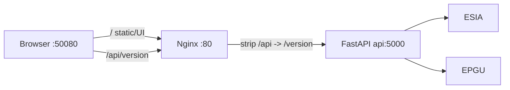
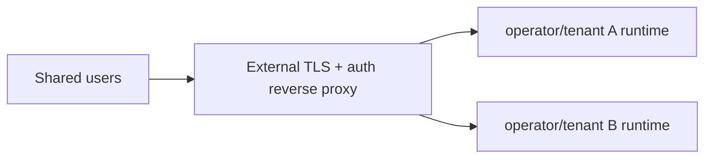

# 02 - Архитектура и запуск

## Compose-сервисы

### `api`

- Образ: `api-gosuslugi-backend:latest`.
- Build context: корень monorepo; Dockerfile: `api-gosuslugi-backend/Dockerfile`.
- База: `python:3.12-slim-bookworm`.
- Runtime user: непривилегированный `app`.
- В образ копируются `python-epgu`, backend-код, `service_profiles.json` и каталог `xml/`.
- Порт: `127.0.0.1:${API_PORT:-55000}:5000`.
- Healthcheck: `GET http://127.0.0.1:5000/version`.
- Команда: `uvicorn app:app --host 0.0.0.0 --port 5000`.

Публичный образ не устанавливает CryptoPro/`pycades`. Это не мешает `/version`, Swagger, каталогу услуг, XML/XSD и preview. CSP readiness проверяется отдельно через `/hc` или `/status`.

### `frontend`

- Образ: `api-gosuslugi-client`.
- Build context: `api-gosuslugi-client`.
- Build stage: `node:24-alpine`, `npm ci`, `npm run build`.
- Runtime stage: `nginx:stable-alpine`.
- Порт: `127.0.0.1:${FRONTEND_PORT:-50080}:80`.
- Healthcheck: `GET http://127.0.0.1/`.
- `depends_on` ждёт healthy-состояния `api`.

React получает build argument `BACKEND_URL` (`/api` по умолчанию). В runtime `entrypoint.sh` подставляет `BACKEND_API` (`http://api:5000`) во встроенный `default.conf.template` и запускает Nginx.

## Публичные порты

| Сервис | Host default | Container | Назначение |
|---|---:|---:|---|
| `api` | `127.0.0.1:55000` | `5000` | FastAPI напрямую с локальной машины |
| `frontend` | `127.0.0.1:50080` | `80` | Локальный React UI и `/api/` proxy |

Debug-порт не публикуется. Внутренние Docker DNS/порты доступны только сервисам compose-сети.

## Proxy и маршрутизация



Завершающий slash в `proxy_pass ${BACKEND_API}/` снимает внешний префикс `/api/`. Поэтому корректная пара по умолчанию:

```dotenv
BACKEND_URL=/api
BACKEND_API=http://api:5000
```

`BACKEND_API=http://api:5000/api` неверен: backend routes объявлены как `/version`, `/services`, `/order` и т. п.; `/api` - внешний frontend-префикс.

Nginx задаёт `client_max_body_size 64m`, отключает proxy buffering и использует `proxy_read_timeout`/`proxy_send_timeout` 300 секунд. Backend ограничивает каждый исходный файл и их сумму 50 000 000 байт, формирует ZIP в памяти и только затем нарезает upstream chunks до 50 МБ.

## Security boundary и tenancy

Стандартный Compose привязывает оба host-порта к loopback. Backend хранит access token, активный certificate id и certificate objects глобально в процессе, поэтому один runtime соответствует одному оператору/tenant.



Для LAN/public deployment нельзя просто опубликовать `55000`/`50080` на `0.0.0.0`. Нужен внешний gateway с authentication, authorization, TLS, rate limits и аудитом, а также отдельный backend process/runtime и secrets scope на каждого оператора/tenant. CORS служит только browser-policy и не заменяет контроль доступа.

## Неизменяемый runtime

Compose не использует bind mounts или named volumes. Код, profiles, XML/XSD, React build, Nginx template и entrypoint встроены в образы. Это устраняет зависимость от line endings и неполных host mounts, но после изменения файлов требуется rebuild соответствующего образа.

## Запуск и проверка

```powershell
docker compose config --quiet
docker compose build
docker compose up -d
docker compose ps

curl.exe http://localhost:55000/version
curl.exe http://localhost:50080/api/version
```

Логи и остановка:

```powershell
docker compose logs -f api frontend
docker compose down
```

## Когда нужна пересборка

- `BACKEND_URL` встраивается в React: после его изменения пересоберите frontend.
- `BACKEND_API` подставляется при старте: достаточно пересоздать frontend-контейнер.
- Изменения backend-кода, Python-библиотеки, profile registry или XML/XSD требуют пересборки `api`.
- Изменения React-кода, Nginx template или entrypoint требуют пересборки `frontend`.

```bash
docker compose up -d --build api
docker compose up -d --build frontend
```

## Standalone-разработка

Backend можно запустить локальным `uvicorn`; в этом режиме он читает `SERVICES` напрямую. Compose использует внешнее имя `SERVICES_OVERRIDE` и отображает его во внутреннюю `SERVICES`.

Для frontend:

```bash
cd api-gosuslugi-client
npm ci
npm start
```

Локальный dev port определяется `.env.development`; он не связан с compose-портом `50080`.

См. также [03-config-and-known-issues.md](./03-config-and-known-issues.md) и [deployment.md](../deployment.md).
