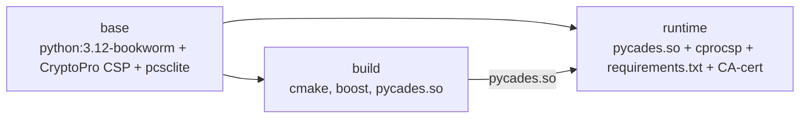
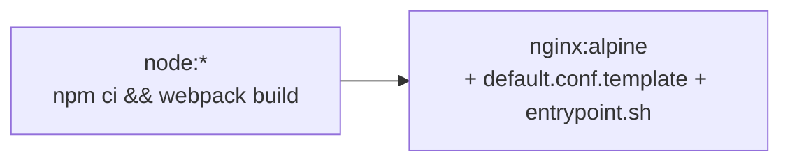

# Развёртывание

## Через docker-compose

```bash
docker-compose up -d --build
```

Сервисы:

| Сервис | Образ | Порты | Назначение |
|---|---|---|---|
| `api` | `api-gosuslugi-backend:latest` | `5000` (HTTP), `5678` (debugpy) | FastAPI |
| `frontend` | `api-gosuslugi-client` | `5080:80` | Nginx + React build |

Все переменные окружения читаются из корневого `.env`. См. [api.md](./api.md#переменные-окружения) и корневой [HOWTO.md](../HOWTO.md).

## Сборка backend-образа

Multi-stage Dockerfile (`api-gosuslugi-backend/Dockerfile`):



Ключевые шаги:

1. Установка КриптоПро CSP из `linux-amd64_deb.tgz`.
2. Сборка `pycades.so` из исходников (`cryptopro.ru/.../pycades.zip`).
3. Установка CA-сертификата тестового ЕСИА (`certenroll.test.gosuslugi.ru/cdp/test_ca_rtk3.cer`).
4. Монтирование папки ключа через compose-volume: `${key_folder}:/var/opt/cprocsp/keys/app/xxx.000`.
5. `entrypoint.sh` выполняет инициализацию CSP перед стартом uvicorn.

## Сборка frontend-образа



`entrypoint.sh` подставляет переменные (`BACKEND_API`) в `default.conf.template` → `/etc/nginx/conf.d/default.conf` и запускает Nginx. Путь `/api` проксируется на backend.

## Volumes

| Источник (хост) | Цель (контейнер) | Сервис |
|---|---|---|
| `./api-gosuslugi-backend/app.py` | `/app/app.py` | api |
| `./api-gosuslugi-backend/.env` | `/app/.env` | api |
| `${key_folder}` | `/var/opt/cprocsp/keys/app/xxx.000` | api |
| `./api-gosuslugi-backend/certs` | `/certs` | api (внутри: `public/` — публичные CA, `personal/` — личные, gitignored) |
| `./api-gosuslugi-backend/xml` | `/xml` | api |
| `./api-gosuslugi-client/default.conf.template` | `/etc/nginx/conf.d/default.conf.template` | frontend |
| `./api-gosuslugi-client/entrypoint.sh` | `/entrypoint.sh` | frontend |

## Ресурсы

В `docker-compose.yml` для `api` заданы лимиты: `cpus=0.5`, `memory=512M`. Для нагрузочного теста увеличить.

## Production-чеклист

- [ ] `production=1` (отключает debugpy, уровень INFO).
- [ ] Заменить тестовые `esia_host`/`svcdev_host` на боевые.
- [ ] Ограничить CORS `allow_origins` конкретным доменом.
- [ ] `KeyPin` — через Docker secrets / Vault, а не env.
- [ ] HTTPS на frontend (отдельный reverse proxy / certs).
- [ ] Журналирование операций подписания (audit log).
- [ ] Мониторинг `/hc`, алерты на ошибки.

## Отладка

- VS Code → Remote Attach → `localhost:5678`.
- Логи: `docker-compose logs -f api frontend`.
- Проверка health: `curl http://localhost:5000/hc`.
