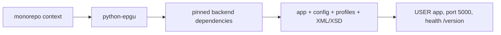
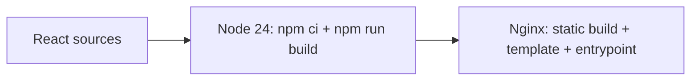

# Развёртывание

## Docker Compose

Из корня репозитория:

```bash
docker compose up -d --build
```

Compose публикует только два порта:

| Сервис | Образ | Host → container | Назначение |
|---|---|---|---|
| `api` | `api-gosuslugi-backend:latest` | `127.0.0.1:${API_PORT:-55000}:5000` | FastAPI core/catalogue |
| `frontend` | `api-gosuslugi-client` | `127.0.0.1:${FRONTEND_PORT:-50080}:80` | React UI и Nginx proxy `/api/` |

Backend проверяется встроенным Docker healthcheck через `GET /version`. Frontend объявляет `depends_on: api: condition: service_healthy`, поэтому Nginx запускается только после готовности core API. Сам frontend проверяется запросом `GET /`.

Оба порта привязаны только к loopback и недоступны напрямую с других машин. Это обязательная граница по умолчанию: backend хранит access token и выбранный сертификат в глобальном состоянии процесса и рассчитан на одного оператора.

`/hc` не используется для compose readiness: без отдельно лицензированных CryptoPro/`pycades` он намеренно возвращает degraded/`503`, тогда как `/version` остаётся доступен.

## Backend-образ

Публичный [Dockerfile](../api-gosuslugi-backend/Dockerfile) собирается из корня monorepo на `python:3.12-slim-bookworm`:


```mermaid
flowchart LR
    root["monorepo context"] --> sdk["python-epgu"]
    sdk --> deps["pinned backend dependencies"]
    deps --> app["app + config + profiles + XML/XSD"]
    app --> runtime["USER app, port 5000, health /version"]
```

Образ:

- запускается непривилегированным пользователем `app`;
- содержит Python-библиотеку, backend-код, `service_profiles.json` и runtime XML/XSD;
- не содержит и не распространяет CryptoPro CSP, `pycades` или контейнеры закрытых ключей;
- поддерживает каталог, Swagger, XML/XSD-проверку и preview без CSP;
- требует отдельного лицензированного signing runtime для получения подписанного токена и операций detached CAdES.

## Frontend-образ и proxy

Frontend — multi-stage образ: сборка выполняется на `node:24-alpine`, runtime — `nginx:stable-alpine`.


```mermaid
flowchart LR
    src["React sources"] --> node["Node 24: npm ci + npm run build"]
    node --> nginx["Nginx: static build + template + entrypoint"]
```

`BACKEND_URL` — build argument React, по умолчанию `/api`. `BACKEND_API` — runtime-адрес upstream для Nginx, по умолчанию `http://api:5000`.

Шаблон Nginx и `entrypoint.sh` встроены в образ. При старте `envsubst` атомарно создаёт конфигурацию, после чего Nginx запускается foreground-процессом. Правило:

```nginx
location /api/ {
    proxy_pass ${BACKEND_API}/;
}
```

снимает внешний префикс: запрос браузера `/api/version` уходит backend как `/version`. Поэтому в `BACKEND_API` не нужно добавлять `/api`.

Nginx принимает тело запроса не более `64m`, отключает request/response buffering для API и использует `proxy_read_timeout`/`proxy_send_timeout` по 300 секунд. Frontend передаёт исходный комплект целиком; backend ограничивает каждый файл и сумму 50 000 000 байт, затем собирает ZIP и нарезает upstream-части до 50 МБ.

## Неизменяемые контейнеры

В текущем `docker-compose.yml` нет bind mounts или named volumes. Исходники, profile registry, XML/XSD, frontend build, Nginx template и entrypoint входят в образы. После изменения любого из этих файлов образ нужно пересобрать:

```bash
docker compose up -d --build api
docker compose up -d --build frontend
```

Локальные `.env`, сертификаты и ключевые контейнеры не монтируются в публичный runtime.

## Конфигурация услуг

Compose намеренно читает `SERVICES_OVERRIDE` из корневого `.env` и передаёт его процессу backend под именем `SERVICES`:

```yaml
- SERVICES=${SERVICES_OVERRIDE:-}
```

Это не позволяет старому legacy `SERVICES` из локального `.env` незаметно заменить versioned-каталог. При standalone-запуске backend без Compose приложение по-прежнему читает переменную `SERVICES` напрямую.

## Проверка запуска

```bash
docker compose config --quiet
docker compose ps
curl http://localhost:55000/version
curl http://localhost:50080/
curl http://localhost:50080/api/version
```

Логи:

```bash
docker compose logs -f api frontend
```

## Production-чеклист

- [ ] Не публиковать `55000` или `50080` напрямую в LAN/Internet и не заменять loopback bind на `0.0.0.0` без защищённого gateway.
- [ ] Для shared/public deployment поставить внешний reverse proxy с TLS, authentication, authorization, rate limits и аудитом перед frontend/API.
- [ ] Выделять отдельный backend process/runtime на оператора или tenant: общие `ACCESS_TKN_ESIA`, `CURRENT_CERT_ID` и certificate store нельзя безопасно разделять между пользователями.
- [ ] Использовать формальные адреса среды: test `svcdev-gostapi.test.gosuslugi.ru`, production `www.gosuslugi.ru`.
- [ ] Задать `ALLOWED_ORIGINS` точным HTTPS origin frontend; CORS не заменяет authentication/authorization.
- [ ] Хранить API key и все signing secrets вне Git и вне публичного образа.
- [ ] Подключить отдельно лицензированный CryptoPro/`pycades` runtime и доверенную для контура цепочку CA, если нужны операции подписи.
- [ ] Завершить TLS на внешнем reverse proxy перед frontend/API.
- [ ] Мониторить `/version` как core readiness; состояние CSP проверять отдельно через `/hc`/`/status`.
- [ ] Согласовать ingress/body limits, backend memory и таймауты с реальными размерами документов; не повышать `64m`/300 с без нагрузочной проверки.
- [ ] Включить аудит операций подписания без журналирования PII и содержимого заявлений.
- [ ] Проверить регламентную регистрацию ИС и согласия отдельно для test/prod контуров.

Подробности переменных окружения: [api.md](./api.md#переменные-окружения).
