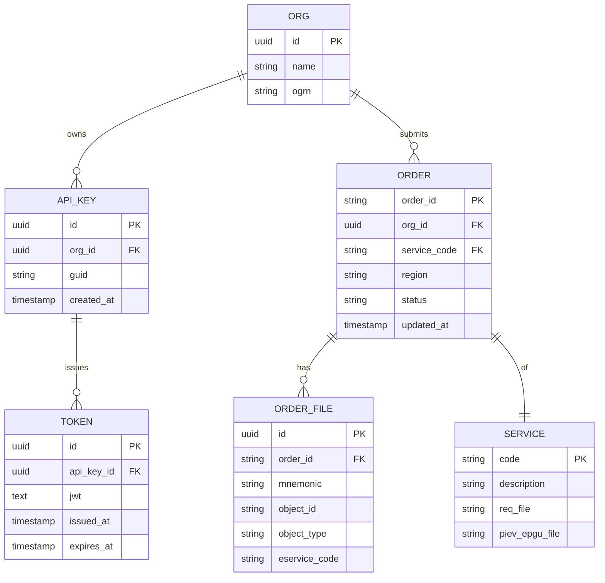

# Схемы данных

## XML / XSD

Файлы в `api-gosuslugi-backend/xml/`:

| Файл | Назначение |
|---|---|
| `req.xml` | Эталонный запрос (meta-обёртка) |
| `piev_epgu.xml` | Тело заявления, вложение в zip |
| `piev_epgu.xsd` | XSD-схема для валидации `piev_epgu.xml` |

Валидация:

```python
schema_root = etree.parse(XSD_FILE)
schema = etree.XMLSchema(schema_root)
schema.assertValid(etree.fromstring(xml_content))
```

Перечисления из XSD доступны через `GET /xsd?simple_type_name=<name>` — удобно для построения выпадающих списков в UI.

## Справочник услуг (env `SERVICES`)

JSON-объект, где ключ — код услуги, значение — параметры:

```json
{
  "10000000367": {
    "description": "Подача заявлений/ходатайств/объяснений",
    "req_file": "req.xml",
    "piev_epgu_file": "piev_epgu.xml",
    "region": "45000000000",
    "targetCode": "-10000000367",
    "eServiceCode": "10000000367",
    "serviceTargetCode": "-10000000367"
  }
}
```

Возвращается клиенту через `GET /services`.

## Pydantic-модели (backend)

### `APIKeyRequest`

| Поле | Тип | Описание |
|---|---|---|
| api_key | str | GUID API-ключа |

### `OrderRequest`

| Поле | Тип | Default | Описание |
|---|---|---|---|
| region | str | `45000000000` | ОКТМО |
| serviceCode | str | `60010153` | Код услуги |
| targetCode | str | `-60010153` | Код цели |

## Внутренние структуры

### Сертификат в памяти

| Ключ | Пример |
|---|---|
| thumbprint (id) | `A1B2C3...` |
| SubjectName | `CN="ООО Рога и Копыта", OU="IT", O="Рога"...` |

Парсится функцией `parse_string_to_json` в словарь `{CN, OU, O, SN, ...}`.

### Структура ответа `POST /order/{orderId}`

```json
{
  "message": "Детали запроса успешно получены.",
  "fileDetails": [
    {
      "objectId": "<currentStatusHistoryId>",
      "objectType": "<last segment of file.link>",
      "mnemonic": "piev_epgu.zip",
      "eserviceCode": "<serviceCode из запроса>"
    }
  ],
  "orderDetails": { "orderResponseFiles": [ ... ] }
}
```

## «Таблицы» (условная БД)

БД отсутствует; сущности живут в памяти процесса. Если делать таблицы (например, при переходе на PostgreSQL) — логичная схема:



См. также [data-model.md](./data-model.md).
