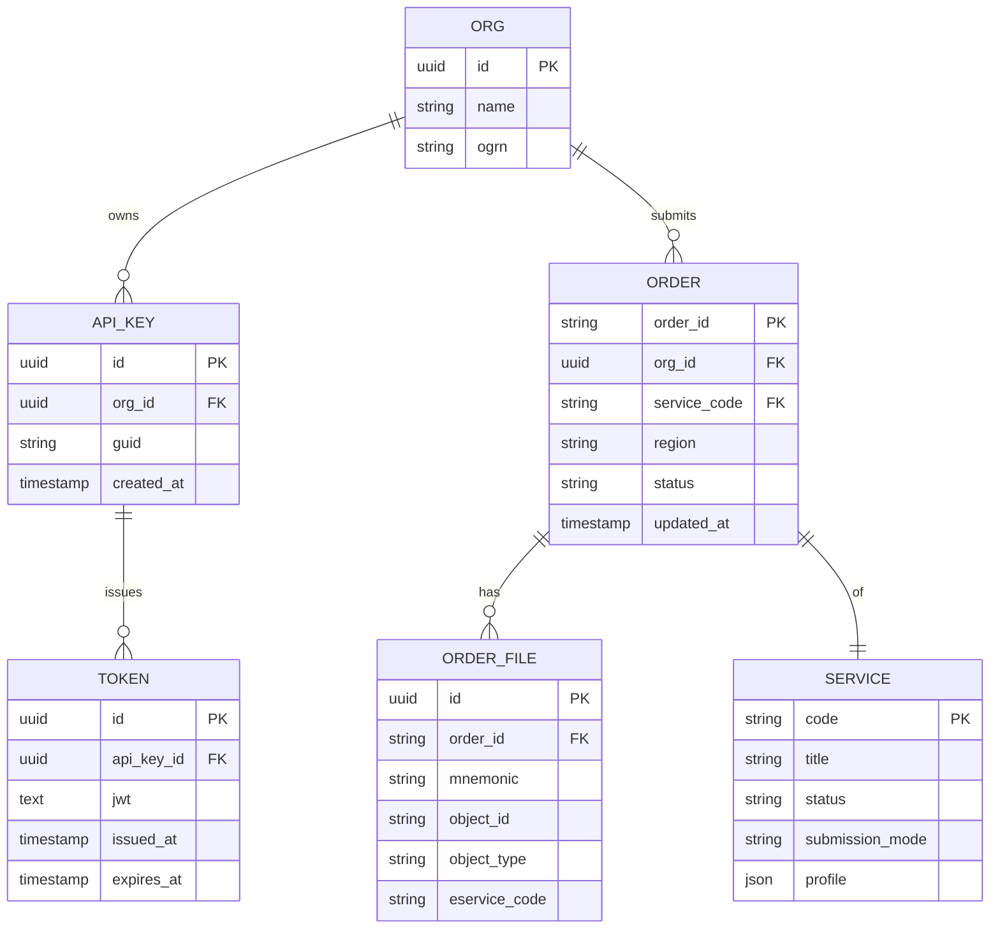

# Схемы данных

> Актуализировано: **2026-08-12**. Источник истины по XML/XSD — спецификации отдельных услуг на [портале партнёров](https://partners.gosuslugi.ru/catalog/api_for_gu); локальный снимок и SHA-256 находятся в [api_for_gu](./api_for_gu/README.md), полный каталог — в [SERVICES.md](./SERVICES.md).

## XML / XSD

Файлы в `api-gosuslugi-backend/xml/` относятся к каталогизированному, но заблокированному профилю `60010153` и не служат универсальной схемой для всех услуг. XSD и транспорт известны, однако XML содержит демонстрационные данные и не является готовым пользовательским вводом:

| Файл | Назначение |
|---|---|
| `req.xml` | Демонстрационная meta-обёртка запроса |
| `piev_epgu.xml` | Демонстрационное тело заявления, вложение в zip |
| `piev_epgu.xsd` | XSD-схема для валидации `piev_epgu.xml` |

Backend выбирает `schemaFile` из `submission.documents[]`, безопасно разрешает путь внутри `XML_ROOT` и кеширует скомпилированную схему:

```python
parser = etree.XMLParser(resolve_entities=False, no_network=True, huge_tree=False)
schema = _load_schema(document_profile["schemaFile"])
schema.assertValid(etree.fromstring(xml_content, parser=parser))
```

Перечисления доступны через `GET /xsd?service=<code>&simple_type_name=<name>`. Endpoint принимает только исполняемый профиль с локальной XSD; отсутствие схемы возвращает `404`, reference-only профиль — `409`.

## Справочник услуг (env `SERVICES`)

`service_profiles.json` — сгенерированный versioned-реестр. `SERVICES` может быть только строгим deep-overlay; добавляемая услуга обязана содержать полный профиль. Ниже — иллюстративный фрагмент встроенного профиля, а не готовый полный override:

```json
{
  "60010153": {
    "serviceCode": "60010153",
    "title": "Предоставление информации о наличии исполнительного производства онлайн",
    "status": "reference",
    "available": false,
    "unavailableReason": "Нужны типизированная форма, fail-closed проверка placeholder/полей и приёмка в авторизованном контуре.",
    "protocol": "gusmev-order",
    "targetCode": "-60010153",
    "submission": {
      "mode": "chunked",
      "archiveNameTemplate": "{orderId}-archive.zip",
      "chunkSize": 5000000,
      "documents": [
        {"id": "transport", "outputName": "req.xml", "validation": "well-formed"},
        {"id": "request", "outputName": "piev_epgu.xml", "schemaFile": "piev_epgu.xsd", "validation": "xsd"}
      ]
    },
    "spec": {"source": "https://gu-st.ru/...docx", "sha256": "..."}
  }
}
```

Возвращается клиенту через `GET /services`. Такой профиль можно включить только после замены демонстрационного XML типизированной формой, fail-closed валидации всех placeholder/полей и проверки в авторизованном контуре.

## Pydantic-модели (backend)

### `APIKeyRequest`

| Поле | Тип | Описание |
|---|---|---|
| api_key | str | GUID API-ключа |

### `OrderRequest`

| Поле | Тип | Default | Описание |
|---|---|---|---|
| region | str | обязательное | Runtime ОКАТО пользователя |
| serviceCode | str | обязательное | Код зарегистрированной услуги |
| targetCode | str | обязательное | Должен совпасть с профилем услуги |

### `GoskeyRequest`

Typed DTO содержит `serviceCode`, runtime `region`, вариант/тип получателя и его идентификаторы, `signExpiration`, описание, реквизиты организации, optional backlink/orderId. Допустимые варианты публикует `GET /goskey/capabilities`; `reference` варианты не генерируются. `POST /goskey/submit` передаёт DTO строкой в multipart-поле `request`, а документы — повторяемым полем `documents`.

## Внутренние структуры

### Сертификат в памяти

| Ключ | Пример |
|---|---|
| thumbprint (id) | `A1B2C3...` |
| SubjectName | `CN="ООО Рога и Копыта", OU="IT", O="Рога"...` |

Парсится функцией `parse_string_to_json` в словарь `{CN, OU, O, SN, ...}`.

### Структура ответа `POST /order/{orderId}`

```json
{
  "message": "Детали запроса успешно получены.",
  "fileDetails": [
    {
      "objectId": "<currentStatusHistoryId>",
      "objectType": "<last segment of file.link>",
      "mnemonic": "piev_epgu.zip",
      "eserviceCode": "<serviceCode из запроса>"
    }
  ],
  "orderDetails": { "orderResponseFiles": [ ... ] }
}
```

## «Таблицы» (условная БД)

БД отсутствует; сущности живут в памяти процесса. Если делать таблицы (например, при переходе на PostgreSQL) - логичная схема:


```mermaid
erDiagram
    ORG ||--o{ API_KEY : owns
    API_KEY ||--o{ TOKEN : issues
    ORG ||--o{ ORDER : submits
    ORDER ||--o{ ORDER_FILE : has
    ORDER ||--|| SERVICE : of

    ORG {
        uuid id PK
        string name
        string ogrn
    }
    API_KEY {
        uuid id PK
        uuid org_id FK
        string guid
        timestamp created_at
    }
    TOKEN {
        uuid id PK
        uuid api_key_id FK
        text jwt
        timestamp issued_at
        timestamp expires_at
    }
    SERVICE {
        string code PK
        string title
        string status
        string submission_mode
        json profile
    }
    ORDER {
        string order_id PK
        uuid org_id FK
        string service_code FK
        string region
        string status
        timestamp updated_at
    }
    ORDER_FILE {
        uuid id PK
        string order_id FK
        string mnemonic
        string object_id
        string object_type
        string eservice_code
    }
```

См. также [data-model.md](./data-model.md).
