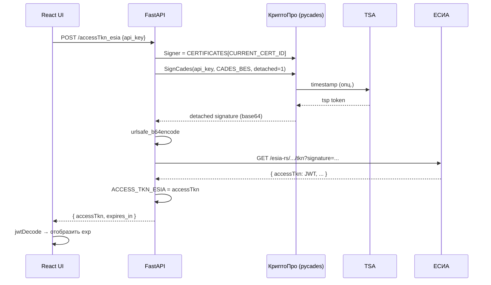
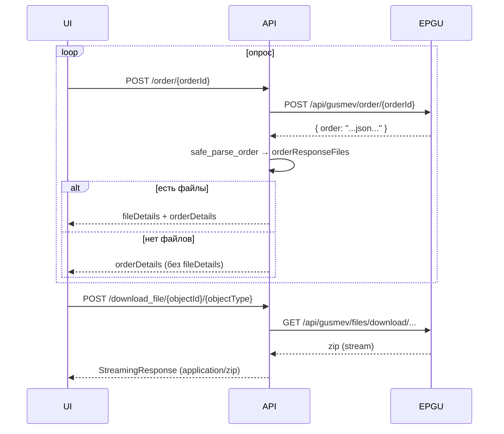
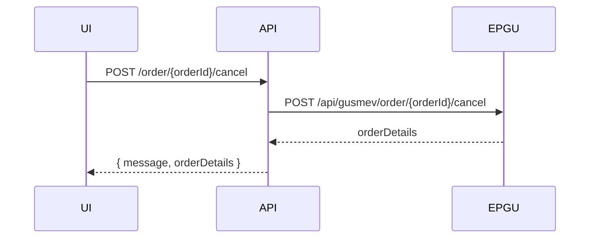
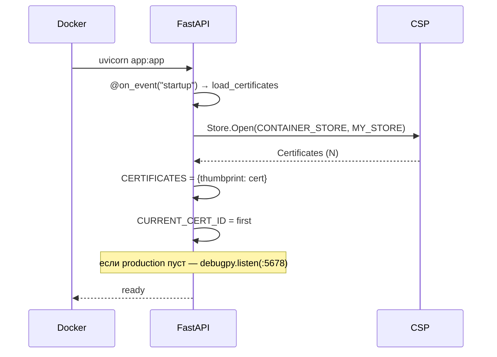

# Диаграммы последовательностей

## 1. Авторизация — получение токена ЕСИА



## 2. Подача заявления (chunked)

```mermaid
sequenceDiagram
    participant UI
    participant API
    participant EPGU

    UI->>API: POST /push/chunked
(meta, orderId, chunks=1, chunk=1, files)
    API->>API: json.loads(meta)
    API->>API: zipfile.ZipFile — собрать piev_epgu.zip
    API->>API: validate piev_epgu.xml по XSD
    API->>EPGU: POST /api/gusmev/push/chunked
(Authorization: Bearer JWT)
    EPGU-->>API: { orderId, ... }
    API-->>UI: { orderId }
```

## 3. Опрос статуса и получение ответа



## 4. Отмена заявления



## 5. Старт приложения (backend)


