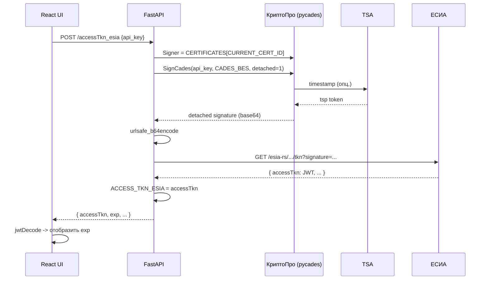
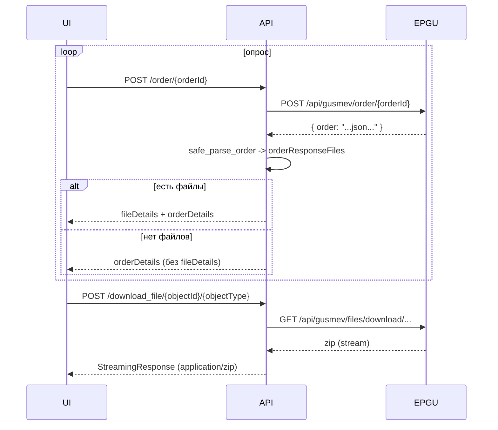
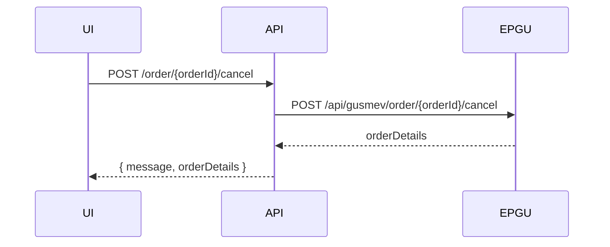
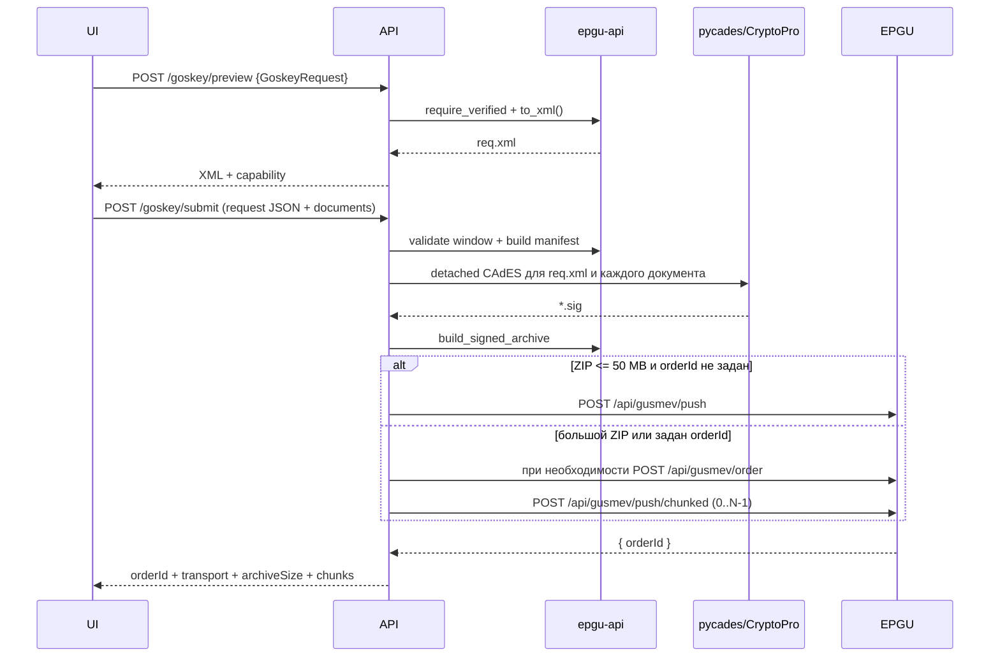

# Диаграммы последовательностей

> Актуализировано: **2026-08-12**. Сценарии соответствуют backend API ЕПГУ v1.14 и versioned-профилям услуг.

## 1. Авторизация - получение токена ЕСИА

```mermaid
sequenceDiagram
    participant UI as React UI
    participant API as FastAPI
    participant CSP as КриптоПро (pycades)
    participant TSA as TSA
    participant ESIA as ЕСИА

    UI->>API: POST /accessTkn_esia {api_key}
    API->>CSP: Signer = CERTIFICATES[CURRENT_CERT_ID]
    API->>CSP: SignCades(api_key, CADES_BES, detached=1)
    CSP->>TSA: timestamp (опц.)
    TSA-->>CSP: tsp token
    CSP-->>API: detached signature (base64)
    API->>API: urlsafe_b64encode
    API->>ESIA: GET /esia-rs/.../tkn?signature=...
    ESIA-->>API: { accessTkn: JWT, ... }
    API->>API: ACCESS_TKN_ESIA = accessTkn
    API-->>UI: { accessTkn, exp, ... }
    UI->>UI: jwtDecode -> отобразить exp
```

## 2. Подача заявления (chunked)

```mermaid
sequenceDiagram
    participant UI
    participant API
    participant EPGU

    UI->>API: POST /order {meta}
    API->>EPGU: POST /api/gusmev/order
    EPGU-->>API: { orderId }
    API-->>UI: { orderId }
    UI->>API: POST /push/chunked
(meta, orderId, source files)
    API->>API: проверить профиль, имена, XML/XSD/.sig
    API->>API: один раз собрать ZIP и разделить на N частей
    loop chunk = 0..N-1
        API->>EPGU: POST /api/gusmev/push/chunked
(chunk, chunks=N, Authorization: Bearer JWT)
        alt не последняя часть
            EPGU-->>API: HTTP 206 + тот же orderId
        else последняя часть
            EPGU-->>API: HTTP 200 + тот же orderId
        end
    end
    API-->>UI: { orderId }
```

Имена многотомного архива имеют суффиксы `.z001`, `.z002`, ..., но поле `chunk` нумеруется с нуля. Клиентские legacy-поля разрешены только как `chunks=1`, `chunk=0`; нарезку всегда выполняет backend.
Если ZIP помещается в одну часть, backend отправляет обычное имя `.zip` и не добавляет upstream-поля `chunk`/`chunks`.

## 3. Опрос статуса и получение ответа

```mermaid
sequenceDiagram
    participant UI
    participant API
    participant EPGU

    loop опрос
        UI->>API: POST /order/{orderId}
        API->>EPGU: POST /api/gusmev/order/{orderId}
        EPGU-->>API: { order: "...json..." }
        API->>API: safe_parse_order -> orderResponseFiles
        alt есть файлы
            API-->>UI: fileDetails + orderDetails
        else нет файлов
            API-->>UI: orderDetails (без fileDetails)
        end
    end
    UI->>API: POST /download_file/{objectId}/{objectType}
    API->>EPGU: GET /api/gusmev/files/download/...
    EPGU-->>API: zip (stream)
    API-->>UI: StreamingResponse (application/zip)
```

## 4. Отмена заявления

```mermaid
sequenceDiagram
    UI->>API: POST /order/{orderId}/cancel
    API->>EPGU: POST /api/gusmev/order/{orderId}/cancel
    EPGU-->>API: orderDetails
    API-->>UI: { message, orderDetails }
```

## 5. Старт приложения (backend)

```mermaid
sequenceDiagram
    participant Host as Служба ОС
    participant App as FastAPI
    participant CSP

    Host->>App: uvicorn app:app
    App->>App: lifespan -> best-effort load_certificates
    alt pycades/CSP доступны
        App->>CSP: Store.Open(CONTAINER_STORE, MY_STORE)
        CSP-->>App: Certificates (N)
        App->>App: CERTIFICATES = {thumbprint: cert}
        App->>App: CURRENT_CERT_ID = first (если N > 0)
    else CSP отсутствует
        App->>App: warning; core/catalogue остаётся доступным
    end
    Note over App: debugpy.listen(:5678) только при DEBUG=true/1/yes
    App-->>Host: ready
```

## 6. Госключ: preview и adaptive-отправка

```mermaid
sequenceDiagram
    participant UI
    participant API
    participant SDK as epgu-api
    participant CSP as pycades/CryptoPro
    participant EPGU

    UI->>API: POST /goskey/preview {GoskeyRequest}
    API->>SDK: require_verified + to_xml()
    SDK-->>API: req.xml
    API-->>UI: XML + capability
    UI->>API: POST /goskey/submit (request JSON + documents)
    API->>SDK: validate window + build manifest
    API->>CSP: detached CAdES для req.xml и каждого документа
    CSP-->>API: *.sig
    API->>SDK: build_signed_archive
    alt ZIP <= 50 MB и orderId не задан
        API->>EPGU: POST /api/gusmev/push
    else большой ZIP или задан orderId
        API->>EPGU: при необходимости POST /api/gusmev/order
        API->>EPGU: POST /api/gusmev/push/chunked (0..N-1)
    end
    EPGU-->>API: { orderId }
    API-->>UI: orderId + transport + archiveSize + chunks
```
