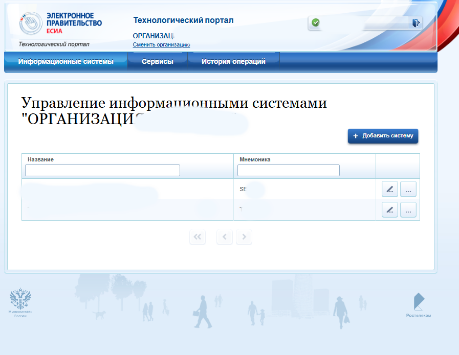
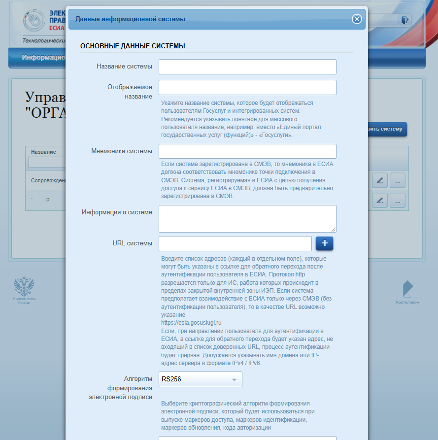
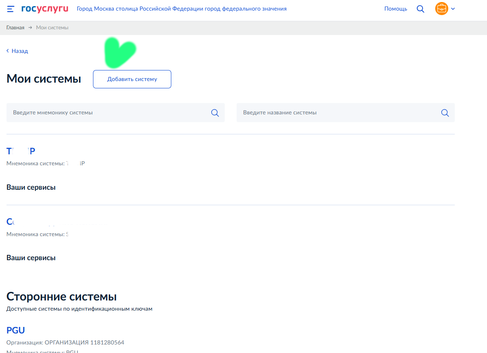
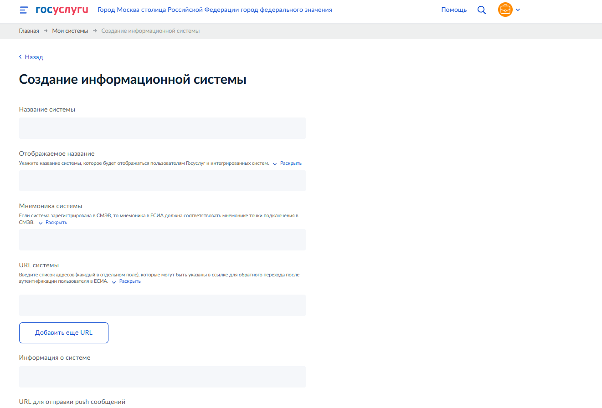
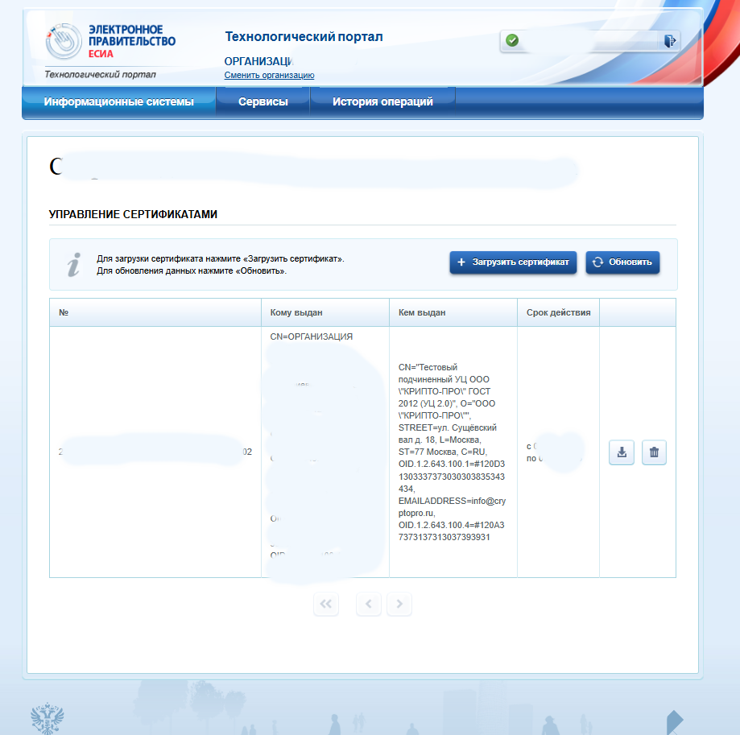

Упростите свою работу с Госуслугами, используя PyCades! В этой статье мы предложим простые шаги для автоматизации работы с заявлениями через API Госуслуг, устраним рутину  с формами и сделаем проще взаимодействие с информационными системами. ?️?


# Работы с API Госуслуг с помощью PyCades

## ЕСИА и ЕПГУ: автоматизация заявлений и результатов

На Хабре есть много статей о СМЭВ, но информации о работе с API Госуслуг через КриптоПро и ключи API недостаточно. Это кажется странным, учитывая, что КриптоПро предназначен для работы с ЭЦП и Госуслугами. В моей статье я расскажу, как использовать Python, PyCades – обертку для КриптоПро, и ключи API для автоматизации процессов. Несмотря на наличие руководств по ЕСИА и ЕПГУ, автоматизация работы с ними через ключи API описана недостаточно подробно. Шаблон сервиса в моей статье позволяет протестировать все эндпоинты и услуги. Например, отправку документов на подпись в «Госключ», работу с миграционным и регистрационным учетом для гостиниц, предоставление информации о ходе исполнительного производства онлайн и многое другое. Запросы отличаются только форматом вложений и некоторыми полями идентификаторов.

## Подготовка окружения: инструменты и ключи

Я использую Docker, чтобы упростить настройку окружения. Для того чтобы всё заработало, необходимо правильно подготовить систему и, как минимум, зарегистрировать информационную систему (ИС) в тестовой среде API Госуслуг. Приступим к настройке.

## 1. Общая информация

| Тестовая среда              | Адрес                                                                                                |
| --------------------------- | ---------------------------------------------------------------------------------------------------- |
| ЕСИА                        | [esia-portal1.test.gosuslugi.ru](https://esia-portal1.test.gosuslugi.ru/)                            |
| ЕПГУ                        | [svcdev-beta.test.gosuslugi.ru](https://svcdev-beta.test.gosuslugi.ru/)                              |
| Технологический портал ЕПГУ | [svcdev-partners.test.gosuslugi.ru](https://svcdev-partners.test.gosuslugi.ru/)                      |
| Технологический портал ЕСИА | [esia-portal1.test.gosuslugi.ru/console/tech/](https://esia-portal1.test.gosuslugi.ru/console/tech/) |

## 2. Регистрация физических лиц и организаций в ЕСИА

### Регистрация физического лица

- Зарегистрироваться в [тестовой среде ЕСИА](https://esia-portal1.test.gosuslugi.ru/registration/).
- Ввести личные данные (ФИО полностью, паспорт, СНИЛС, реальную почту и телефон).
- Подтвердить учётную запись через центр госуслуг или по почте.
- При необходимости проверить код подтверждения в [логах почты](https://esia-portal1.test.gosuslugi.ru/logs/postcodes/).

### Регистрация организации в ЕСИА

- Войти в [тестовую среду ЕСИА](https://esia-portal1.test.gosuslugi.ru/).
- Использовать КЭП генерального директора (или другую проверенную подпись).
- Заполнить заявку с указанием ОГРН, ИНН и наименования организации.
- Подключить учётные записи сотрудников.
- Выдать доверенности и полномочия для формирования API-ключей.

## 3. Получение тестового сертификата и подписи

### Запрос и установка сертификата и подписи

- Отправить заявку на [sd@sc.digital.gov.ru](mailto:sd@sc.digital.gov.ru) с заполненной формой.
- Получить PIN-код, архив с сертификатом и закрытым ключом.
- Установить сертификат в хранилище КриптоПро.
- Проверить корректность сертификата с помощью утилиты certmgr.

## 4. Регистрация информационной системы (ИС)

### Регистрация и настройка ИС

- Зарегистрировать ИС в [Технологическом портале ЕСИА](https://esia-portal1.test.gosuslugi.ru/console/tech)   или в [Портале ЕСИА](https://svcdev-partners.test.gosuslugi.ru/systems)  
- Указать мнемонику тестовой ИС.
- Загрузить публичную часть сертификата. 
- Отправить заявку на [sd@sc.digital.gov.ru](mailto:sd@sc.digital.gov.ru).

## 5. Получение тестового API-ключа

### Запрос API-ключа

- Добавить сотрудника с нужными полномочиями в ИС.
- Подать заявку в разделе «Мои системы» ([https://svcdev-partners.test.gosuslugi.ru/systems](https://svcdev-partners.test.gosuslugi.ru/systems)).
- Скачать ключ в формате CSV.

## 6. Настройка взаимодействия с API Госуслуг

### Получение токена доступа

- Запросить `access_token` через OAuth 2.0.
- Проверить валидность токена тестовым запросом.

### Настройка сертификатов и безопасности

- Установить КриптоПро и подключить КЭП.
- Файлы закрытого ключа обычно хранятся в папке формата XXX.000, сертификат cer, реже в другом формате. Если использовали для регистрации на тестовом портале неоткрепленную подпись - рутокен или аналог - не беда, есть [инструкция](https://pushorigin.ru/cryptopro/real-cert-crypto-pro-linux).
- Установить `.env` и далее `docker-compose --env-file .env up -d`
- Убедиться, что в тестовой среде корректно проходит валидация подписей.

## 7. Работа с заявками на предоставление услуги

### Резервирование номера заявки

- Отправить запрос через API (`POST /api/gusmev/order`).
- Получить номер заявки (`orderId`), который понадобится для последующей отправки данных.

### Формирование и отправка XML-запроса

- Собрать XML-документ по XSD-схеме.
- Подписать XML КЭП и проверить подпись.
- Отправить запрос через `POST /api/gusmev/push` или (при больших архивах или особых требованиях) через `POST /api/gusmev/push/chunked`, используя `orderId`.
- При успешном выполнении запросов получить номер заявки (либо повторное подтверждение ранее используемого `orderId`).

## 8. Обработка ответов

### Получение статуса и загрузка ответа

- Статус заявки: `POST /api/gusmev/order/{orderId}`.
- Получение файла: `GET /download_file/{objectId}/{objectType}`.
- Список заявок на дату: `GET /api/gusmev/order/getUpdatedAfter`.
- Массовые статусы: `GET /api/gusmev/order/getOrdersStatus`.
- Отмена заявки: `POST /api/gusmev/order/{orderId}/cancel`.
- Справочники: `POST /api/nsi/v1/dictionary/{code}`.

## 9. Интеграция с фронтендом и бэкендом

### Простой интерфейс (React)

- Форма подачи заявлений с drag-and-drop загрузкой файлов.
- Редактор XML с поддержкой форматирования и предпросмотра.
- Выбор и управление сертификатами (загрузка, отображение данных, переключение).
- Отображение статуса запроса в реальном времени.

### Работа с бэкендом (FastAPI)

- Авторизация и токены (JWT, API-ключи).
- Запросы к Госуслугам (передача данных, управление заказами).
- Файловый менеджер (загрузка и скачивание документов, валидация ZIP).
- Работа с сертификатами (подпись, настройка КЭП, шифрование).

#### Библиотека CryptoPro

В проекте epgu используется версия `csp/50/12997rc2 linux-amd64_deb.tgz`, доступная как триал. После каждого запуска контейнера отчёт 90 дней начинается заново. Версия PyCades взята с сайта CryptoPro (0.1.44290). Можно поэксперементировать с новой [версией](https://cryptopro.ru/sites/default/files/products/cades/pycades/pycades.zip)

#### Настройка контейнера ключей

Файлы закрытого ключа обычно хранятся в папке формата `XXX.000`, а сертификаты — в `.cer`. Если при регистрации на тестовом портале использовалась неоткреплённая подпись, убедитесь в её совместимости, выполнив пробную операцию подписи (или воспользовавшись утилитой CryptoPro `cryptcp`).

Копируем сертификат и ключ в каталог с проектом (можно заменить существующие `some.cer` и `xxx.000`) либо использовать собственные имена, указав их в `entrypoint.sh` и `docker-compose.yml`.

#### Пример реализации

```bash
git clone https://github.com/yellow444/epgu.git && cd epgu
```

## 10. Выход в продуктивную среду

### Тестирование и развертывание

- Провести интеграционные тесты, проверить стабильность работы.
- Совместно с Оператором убедиться в корректной интеграции.
- Изучать логи для отладки.

### Запуск в эксплуатацию

- Настроить мониторинг API-запросов.
- Подключить пользователей и назначить роли.
- Организовать сбор логов и их анализ.

### Развертывание через Docker

- Использовать `docker-compose.yml` для запуска фронтенда и API.
- При необходимости создать Helm Chart.
- Настроить переменные окружения (`.env`), учитывая безопасность.

## 11. Библиотека на Go

Существует также интересный вариант для тех, кто предпочитает Go: [https://github.com/ofstudio/go-api-epgu](https://github.com/ofstudio/go-api-epgu). Однако для полноценной работы в контейнере или в серверном окружении может потребоваться дополнительная настройка.

## 12. Заключение

### Использование БД

- Пока не реализована работа с БД (MongoDB или Postgres).
- В базе можно будет хранить схемы XML и шаблоны их валидации, исключая прямую работу с файлами.
- Стоит рассмотреть возможность создания Helm Chart для быстрой установки.
- Можно создать универсальный Docker-образ (all-in-one) с полным окружением.
