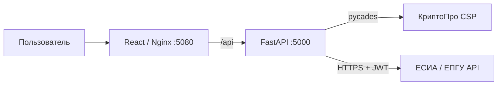

# API Госуслуг (ЕПГУ) — интеграционное решение

Проект автоматизации взаимодействия с API Единого портала государственных услуг (ЕПГУ): подача заявлений, подписание документов через КриптоПро, получение статусов и ответных документов.

> Документация и справочники услуг сверены с [Порталом API Госуслуг](https://partners.gosuslugi.ru/catalog/api_for_gu). Дата актуализации: **2026-05-12**. Реализация ориентирована на спецификацию **API ЕПГУ v1.13** (с учётом правок v1.12.1 по разделам ГОСТ TLS / СМЭВ4).

## Состав репозитория

| Каталог | Назначение |
|---|---|
| [api-gosuslugi-backend/](./api-gosuslugi-backend) | FastAPI-сервис: КриптоПро, подпись, проксирование вызовов ЕПГУ |
| [api-gosuslugi-client/](./api-gosuslugi-client) | React-приложение (Ant Design): UI для подачи заявлений |
| [docs/](./docs) | Архитектура, схемы XML, API, диаграммы Mermaid, регламенты ЕПГУ |
| [habr/](./habr) | Статьи для публикации на Хабре |
| [step/](./step) | Пошаговые инструкции с иллюстрациями (настройка ИС, сертификатов) |

## Быстрый старт

```bash
cp .env .env.local              # заполнить apikey, KeyPin и пр.
docker-compose up -d --build
```

- Фронтенд: <http://localhost:5080>
- Бэкенд (Swagger): <http://localhost:5000/docs>

Подробные сценарии установки и использования — в [HOWTO.md](./HOWTO.md).

## Архитектура (кратко)



Полная архитектура — в [docs/architecture.md](./docs/architecture.md).

## Основные возможности

1. **Авторизация** — организация-потребитель получает JWT-токен через ЕСИА, используя API-ключ и подпись КриптоПро.
2. **Создание заявления** — генерация XML по спецификации ЕПГУ, подпись КриптоПро (CAdES-BES), отправка через API.
3. **Обработка ответов** — статусы поданных заявлений, загрузка ответных документов.
4. **Работа с сертификатами** — список, выбор активного, отображение субъекта.
5. **Администрирование** — управление API-ключами, услугами (через переменную `SERVICES`).
6. **Конфигурация сред** — переключение между тестовым контуром (`*.test.gosuslugi.ru`) и продом (`esia.gosuslugi.ru` / `lk.gosuslugi.ru`) через `.env`.

## Поддерживаемые услуги

| Код | Описание | Источник спецификации |
|---|---|---|
| `60010153` | Наличие исполнительного производства (ФССП) | [Prilozhenie_60010153_Nalichie_IP_v8.docx](https://gu-st.ru/content/partners/api_for_gu/Specifikaciya_API_EPGU_Prilozhenie_60010153_Nalichie_IP_v8.docx) |
| `10000000367` | Подача заявлений / ходатайств / объяснений | [Specifikaciya_API_EPGU_Podacha_zayavlenij_..._10000000367_18_06_2024.docx](https://gu-st.ru/content/partners/api_for_gu/Specifikaciya_API_EPGU_Podacha_zayavlenij_hodatajstv_obyasnenij_v1_3_kod_uslugi_10000000367_18_06_2024.docx) |
| `10000000109` | Доставка пенсии и социальных выплат ПФР/СФР | [partners.gosuslugi.ru/catalog/api_for_gu](https://partners.gosuslugi.ru/catalog/api_for_gu) |
| `60010154` | Предоставление информации о ходе ИП (ФССП) | [Specifikaciya_API_EPGU_Predostavlenie_informacii_o_hode_IP_v_7.docx](https://gu-st.ru/content/partners/api_for_gu/Specifikaciya_API_EPGU_Predostavlenie_informacii_o_hode_IP_v_7.docx) |

Полный каталог, среды и endpoint-ы — в [docs/SERVICES.md](./docs/SERVICES.md).

## Требования

- Docker / Docker Compose
- КриптоПро CSP (устанавливается в backend-образ), сертификат и закрытый ключ организации
- API-ключ организации-потребителя ЕПГУ — получение описано в локальном `docs/Rukovodstvo_polzovatelya_dlya_organizacii-potrebitelya_...docx`

## Документация

- [docs/README.md](./docs/README.md) — указатель по всей документации
- [docs/SERVICES.md](./docs/SERVICES.md) — каталог услуг и спецификаций (актуально на 2026-05-12)
- [docs/architecture.md](./docs/architecture.md) — компоненты и потоки
- [docs/api.md](./docs/api.md) — справочник эндпоинтов
- [docs/schemas.md](./docs/schemas.md) — XML/XSD и модели данных
- [docs/deployment.md](./docs/deployment.md) — развёртывание
- [docs/sequence-diagrams.md](./docs/sequence-diagrams.md) — последовательности
- [habr/](./habr) — статьи

## Лицензия

MIT — см. [LICENSE](./LICENSE).
